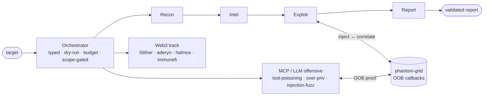

<div align="center">


# 🤖 CyberAI

**Offensive testing for MCP servers and LLM agents — runtime, not metadata**

> Blind findings proven out-of-band, not inferred from response diffs.
> Built by someone who red-teams AI, not just with it.


*Recorded run of the fixed probes against four vulnerable targets in Docker — pass@1 4/4, which says the targets and the harness work. The pipeline itself scores the same suite 4/4 in 21 requests; both cards are linked below. The fourth target is blind: it counts as solved only when a collector we control records the callback. Reproduce with `cyberai bench run --suite local --engine real`.*

</div>

---

## What is CyberAI?

CyberAI is a multi-agent orchestration layer for offensive security. Eight
specialized agents run a typed, auditable pipeline that turns a target into
actionable attack paths and a validated report. Four of them — **Recon,
Intel, Exploit, Report** — form the network chain; **Web3**, **MCP Scan** and
**Redteam** take their own kinds of target, and **Planner** orders the work
the others do. The table below says what each one takes and produces.

Two things set it apart from "LLM wrapper over nmap":

- **OOB-driven exploitation.** Blind vulns (SSRF, XXE, blind injection) are
  confirmed through out-of-band callbacks captured by
  [phantom-grid](https://github.com/evkir/phantom-grid), not guessed from
  response diffs.
- **Agent-trust-aware design.** Every message on its way to a model passes one
  guard, which labels or blocks what scores as an injection before the
  provider is contacted; each phase's output is separately scanned and a hit
  becomes a MEDIUM finding. Adversarial thinking is a design input, not a
  disclaimer — the gaps are named in
  [docs/security/adversarial-robustness.md](docs/security/adversarial-robustness.md).

Reach beyond the network: the **Web3 agent** runs Slither static analysis and
maps detectors to Immunefi severity tiers for smart-contract audits.

**In one sentence:** an offensive AI-supply-chain red-team platform — it attacks
MCP servers and LLM/RAG endpoints, proves blind vulnerabilities out-of-band,
audits Web3 contracts on-chain, and publishes reproducible benchmarks, with a
fully air-gapped path on local models (Ollama/vLLM).

Real orchestrator output (trust-aware pipeline in action):

```text
⚠ injection signals in recon output (risk=25)
[ExploitAgent] Generating OOB payloads...
[ExploitAgent] Polling phantom-grid...
[exploit] OOB callbacks: 1
```


## Quick Start

```bash
pip install cyberai

# dry-run: full pipeline, no real network calls
cyberai scan example.com --dry-run

# real scan with a local model (air-gapped, no cloud) and scope
cyberai scan app.target.com --provider ollama --scope "*.target.com"

cyberai status          # provider, output, trust boundary, sampling, air-gap, credentials, toolchain
cyberai replay <id>     # re-run a saved session
```

**See it on a real target:** a full run against OWASP Juice Shop, committed
exactly as produced — 14 endpoints found, 13 walked, one SQL injection proven
by the database error it returned, and the local model's reading of all of it,
including the 15 parameters that ignored every payload and the 10 that
refused the caller outright:
[examples/juice-shop/](examples/juice-shop/)

**Trust-aware in one sentence:** a malicious banner crafted to hijack the model
is wrapped as untrusted where it is stored, and if it ever reaches a prompt the
guard in front of the provider labels, redacts or blocks it — under `deny`, no
request is made at all. Recon and intel contact no model, so a banner from those
phases reaches one only by way of the report.


---

## Architecture


<details><summary>Diagram source (Mermaid, rendered on GitHub)</summary>



</details>

> **Trust boundary** — one guard inside `LLMClient`, ahead of every provider
> call; phase edges are audited on top of it, in both pipelines.
> Findings reach **confidence = 1.0 only when confirmed out-of-band** via phantom-grid.

**Observability:** JSONL audit log · session export/import · `cyberai replay`
**Interfaces:** CLI · FastAPI dashboard (SSE) · MCP server (Claude Desktop)

### Agents

| Agent | Input | Output | Key tools |
|-------|-------|--------|-----------|
| **Recon** | target | open ports, DNS, WHOIS, subdomains | nmap (flag-whitelisted), async DNS, subdomain enum |
| **Intel** | recon kb | ranked CVEs | NVD client, EPSS enrichment, risk prioritizer |
| **Exploit** | intel kb | attack paths, OOB findings | nuclei, searchsploit, OOB/SSRF/XXE workflows |
| **Report** | session kb | structured Markdown / H1 export | LLM summary + LLM-as-judge validation |
| **Web3** | .sol path / address | severity-tiered findings | Slither, Etherscan, Immunefi classifier |
| **Planner** | kb relationship graph | ordered subtask plan | deterministic ranking, critic that decides retry vs skip |
| **MCP Scan** | MCP endpoint (stdio or HTTP/SSE) | capability surface, poisoning and over-privilege findings | live probe, attestation posture, MST bridge |
| **Redteam** | LLM or RAG channel | injection fuzz report | payload corpus, channel fuzzer, acknowledgement detection |

---

## What's shipped / what's next

CyberAI is an actively developed platform, not a scaffold. Shipped and tagged:

| Version | Focus | Highlights |
|---|---|---|
| **v1.0** | Core platform | typed 4-phase pipeline, OOB exploitation, Web3 (Slither/Immunefi), MCP server, LLM-as-judge, scope import, async, cost tracking |
| **v1.1** | Proof & benchmarks | reproducible bench harness + local vuln suite, honest scorecard, per-phase model router, air-gapped path (egress guard) |
| **v1.2** | MCP/LLM offensive red-team | MCP probe + scan CLI, tool-poisoning & over-privilege detectors, live injection fuzzer, attestation checks, MST bridge |
| **v1.3** | Web3 discovery | aderyn cross-validation, halmos symbolic runner, Foundry on-chain PoC, access-control agent, EVMBench adapter, Immunefi export |
| **v1.4** | Autonomy & unified reporting | graph planner driving exploit order, exploit-memory recall, unified OOB confirmation, behavioral fingerprinting, findings grouped by attack surface |
| **v1.5** | The HTTP surface | API-spec and JS-bundle route discovery, authenticated walks, object-level authorization checks, out-of-band confirmation on the product path |
| **v1.6** | Honest release | one trust boundary in front of the model with three policies, decontaminated proofs, the agent score published, Apache-2.0 |

**Next:** wider public proof — benchmark re-runs published as a tracked delta, sample reports for each attack surface, and reproducible live runs.

---

## Security design

- **One trust boundary in front of the model** — `TrustGuard.inspect()` sits
  inside `LLMClient`, ahead of the provider branch, on all four entry points.
  Nothing reaches OpenAI, Anthropic or Ollama without passing it. It scores
  the raw message and sanitises the copy it sends: the reverse order was
  measured to blind the detector, because sanitisation strips three of the
  categories the detector scores on, so a payload carrying a template marker
  scored *lower* through the guard than raw. System prompts are never
  rewritten — only user, tool and function messages are attacker-reachable.
- **Three policies, one variable** — `CYBERAI_INJECTION_POLICY` selects
  `annotate` (default: label the content as untrusted, send it, record the
  verdict), `quarantine` (label, replace each match with
  `[REDACTED:<category>]`, cap the length), or `deny` (raise; the provider is
  never contacted). Pick `annotate` when a false positive must not corrupt
  legitimate input, `deny` for an engagement where a suspected injection
  should stop the run. `quarantine` is not the default on purpose: it mutates
  content, and the detector it would run on has no published precision. The
  figure behind that choice — 42 flagged of 43 real scan reports — was taken
  on a corpus that is not tracked in this repository and no longer exists. It
  is kept in `core/security/guard.py` as the recorded reason for the default,
  not as a reproducible measurement. `quarantine` becomes the default when W3
  publishes precision and recall on a tracked corpus.
- **Every verdict is in the audit trail** — policy, threshold, score,
  categories and how many messages were modified, written per call. Message
  bodies stay out of it.
- **Prompt-injection detection** — 33 patterns across 10 weighted categories,
  measured rather than described. On the tracked corpus the pattern layer
  scores 62.7% recall at 100.0% precision with a 0.0% false-positive rate,
  and it is blind to three injection subclasses: multilingual, paraphrase,
  social. The optional local-model layer takes recall to 98.0% with the
  false-positive rate unchanged. Neither number is typed by hand — both come
  out of `cyberai detector eval --corpus tests/corpus`, the second with
  `--l2-replay examples/detector-eval/l2-verdicts.json`, and a test fails if
  this paragraph and that command disagree. Also run
  on each phase's *output*, where a hit becomes a MEDIUM finding. That pass
  is an audit signal, not a barrier: it runs after the agent has already
  called the model, and it is labelled as such in the code and the report.
  The barrier is the guard above.
- **Scope enforcement** — wildcard + `!`-exclusion matching honors HackerOne /
  Bugcrowd briefs (`cyberai scope import`).
- **Audit trail** — every agent action logged to JSONL with full
  inputs/outputs; sessions are replayable. Every line is HMAC-signed —
  `cyberai audit-verify <file>` reports any line edited after the run.

---

## Install from source

```bash
git clone https://github.com/evkir/CyberAI.git
cd CyberAI
pip install -e .
```

```bash
cp config.example.yml config.yml
cp .env.example .env
# Edit .env — add OPENAI_API_KEY or ANTHROPIC_API_KEY (not needed for --dry-run)
```

```bash
# Dry-run: walks all 4 phases, no network, no API key
python -m cyberai scan example.com --dry-run

# Real scan, scope-restricted
python -m cyberai scan target.htb --scope '*.target.htb'

# Replay a saved session deterministically
python -m cyberai replay <session_id>

# Import a bug-bounty scope
python -m cyberai scope import h1 --program acme

# Status / config
python -m cyberai status
```

### Web dashboard

```bash
uvicorn cyberai.web.app:app --reload
# http://127.0.0.1:8000  — session list, live SSE progress, report view
```

### MCP server (Claude Desktop / Cursor)

```bash
python -m cyberai.mcp.server
```

Exposes recon/intel tools (`nmap_scan`, `dns_enum`, `cve_search`,
`epss_score`, …) plus `mcp_scan` — which lets the server scan *other* MCP
servers — over the Model Context Protocol. See
[docs/mcp/integration.md](docs/mcp/integration.md).

### MCP / LLM offensive red-team

```bash
cyberai mcp-scan http://target.example.com/mcp --report
```

Inventory a target MCP server or LLM endpoint and emit an OWASP-MCP /
MITRE-ATLAS red-team report. See
[docs/redteam/mcp-scanning.md](docs/redteam/mcp-scanning.md).

---

## Configuration

```yaml
# config.yml
llm:
  provider: openai        # openai | anthropic
  model: gpt-4o
  max_tokens: 4096
  temperature: 0.2

phantom:
  grid_url: http://127.0.0.1:9090

output_dir: reports/
max_cost_usd: 0.0         # 0 = disabled; set to enforce a budget
```

### Environment variables

Every setting can be driven from the environment (or a `.env` file - see
[.env.example](.env.example)). Feature flags are off by default
(no-regression); enable any with `1`/`true`/`yes`/`on`.

| Variable | Effect |
|---|---|
| `CYBERAI_LLM_PROVIDER` / `CYBERAI_MODEL` | LLM provider and model |
| `CYBERAI_USE_BEHAVIORAL` | Honeypot/WAF/tarpit fingerprinting in recon |
| `CYBERAI_USE_PORT_FINGERPRINT` | Banner grab on ports nmap could not name |
| `CYBERAI_USE_NUCLEI` | Nuclei template exploit engine |
| `CYBERAI_USE_JUDGE` | LLM-as-Judge report validation |
| `CYBERAI_ENABLE_REPLAN` | Critic-driven phase replan |
| `CYBERAI_USE_EXPLOIT_MEMORY` | Recall similar past exploit chains |
| `CYBERAI_AIR_GAPPED` | Force local-only (no-egress) LLM path |
| `CYBERAI_STRICT_SCOPE` | Refuse the exploit phase when no scope was given |
| `CYBERAI_ENABLE_MODEL_ROUTING` | Per-phase model selection |
| `CYBERAI_MAX_COST_USD` | LLM spend budget (0 = disabled) |
| `CYBERAI_OUTPUT_DIR` | Report output directory |
| `CYBERAI_SESSION_SECRET` | Audit-trail signing key; unset means a published fallback |

The `scan` command overrides the main flags per run, in either direction:

```bash
cyberai scan example.com --behavioral --nuclei
cyberai scan example.com --no-air-gapped
```


---

## Benchmarks — honest numbers

CyberAI measures its own engine against a small, self-contained suite of
deliberately-vulnerable targets it authors and serves — no third-party
benchmark required to reproduce the numbers.

```bash
cyberai bench list
cyberai bench run --suite local --engine agent --scorecard reports/scorecard-agent.md
cyberai bench run --suite local --engine real  --scorecard reports/scorecard.md
```

Every published number is **reproducible** (targets ship in `cyberai/bench/apps/`),
**binary** (solved only on an unambiguous success signal from a responding
target — never "looks exploited"), and **traceable** (each run emits a scorecard
with engine version, provider, model, timestamp).

Latest run of the local suite (CyberAI 1.6.0, 2026-08-26), scored twice — once by the pipeline that is the product, once by the fixed probes. Both reach 4/4:

| vuln class | solved | total | rate |
| --- | --- | --- | --- |
| sqli | 1 | 1 | 100% |
| command_injection | 1 | 1 | 100% |
| path_traversal | 1 | 1 | 100% |
| ssrf | 1 | 1 | 100% |
| **pass@1** | **4** | **4** | **100%** |

What the pipeline spent reaching that score. The probes produce none of these
numbers, which is why the card beside this one has no metrics section:

| task id | in-band | out of band | endpoints | requests |
| --- | --- | --- | --- | --- |
| local-sqli-login | 2 | 0 | 1 | 5 |
| local-cmdi-ping | 1 | 0 | 1 | 3 |
| local-path-traversal | 1 | 0 | 1 | 3 |
| local-ssrf-fetch | 0 | 1 | 1 | 10 |
| **total** | **4** | **1** | **4** | **21** |

Two engines, one suite, answering different questions. `--engine real` drives
fixed per-class probes: 4/4 there means the targets are exploitable and the
harness works — it measures the bench, not the product. `--engine agent`
drives the full pipeline, which is handed an address and has to discover the
surface before it can attack it; 4/4 there is the product finding and proving
four flaws on its own. The second is the number worth publishing, and it is
the one above.

Read the zero honestly: **the pipeline reaches 4/4 without contacting a
model.** The agent engine constructs no LLM client on this path, and the card
records that rather than implying it — `llm calls 0`, `llm zero reason
engine_uses_no_model`, a proven zero instead of a blank nobody counted.
Discovery, payload selection and proof are code here, not inference. The
model earns its place elsewhere: reading a surface larger than four
endpoints, the analysis and the report. Publishing this suite as evidence of
a language model solving CTFs would be the easy lie — it solved them with no
model at all.

In-band and out-of-band are counted apart because of the blind SSRF target:
it answers identically whichever way the fetch goes, so it is proven by a
callback carrying the run nonce, and folding that into the in-band column
would print a zero on a task that was solved.

Read the suite honestly too: it is **authored by the project it measures**.
It proves the engine works end-to-end against live targets in Docker and
guards against regression between releases — it is not a competitive result
and is not comparable to CVE-Bench or CyBench. The one external suite run so
far, CVE-Bench, scored 0/3 on three selected tasks; the runs and the reason
are in [docs/benchmarks/cve-bench.md](docs/benchmarks/cve-bench.md).

Part of an earlier 4/4 was self-referential — the exploitation engine held a
literal from a target this project wrote. What was wrong, what changed and
what the numbers did afterwards is written up in
[docs/benchmarks/contamination-2026-08.md](docs/benchmarks/contamination-2026-08.md).

Both cards are committed:
[scorecard-agent.md](examples/local-bench/scorecard-agent.md) for the
pipeline, [scorecard.md](examples/local-bench/scorecard.md) for the probes.
The run manifest is not, and `--manifest <path>` reproduces it.

The default `--engine placeholder` reports all-unsolved by design so a scorecard
never overstates capability; `--engine real` runs live per-class probes. External
suites (CVE-Bench, CyBench, EVMBench) plug into the same `BenchTask` contract as
optional adapters for leaderboard parity — never as a product dependency.

See [docs/benchmarks/local-suite.md](docs/benchmarks/local-suite.md) for the
methodology and the current scorecard.

---

## Documentation

| Doc | What |
|-----|------|
| [docs/api/agents.md](docs/api/agents.md) | Agent API reference |
| [docs/exploit/oob-exploitation-workflow.md](docs/exploit/oob-exploitation-workflow.md) | OOB / SSRF walkthrough |
| [docs/web3/web3-audit.md](docs/web3/web3-audit.md) | Smart-contract audit for Immunefi |
| [docs/mcp/integration.md](docs/mcp/integration.md) | MCP server setup |
| [docs/redteam/mcp-scanning.md](docs/redteam/mcp-scanning.md) | MCP/LLM offensive red-team scanning |
| [docs/security/adversarial-robustness.md](docs/security/adversarial-robustness.md) | What the trust boundary covers, and what it does not |
| [docs/research/detector-v2.md](docs/research/detector-v2.md) | The three detector layers, what each was measured at, and what was not measured |
| [examples/detector-eval/baseline.md](examples/detector-eval/baseline.md) | Detector precision and recall on the tracked corpus, per technique |
| [docs/benchmarks/local-suite.md](docs/benchmarks/local-suite.md) | The local suite: targets, success signals, methodology |
| [docs/benchmarks/reproducibility.md](docs/benchmarks/reproducibility.md) | What a run pins, what it records, what it cannot promise |
| [docs/benchmarks/contamination-2026-08.md](docs/benchmarks/contamination-2026-08.md) | A self-referential proof, how it was found, what the numbers did |
| [docs/benchmarks/cve-bench.md](docs/benchmarks/cve-bench.md) | The external suite, scored 0/3, with the cause |
| [docs/architecture/known-issues.md](docs/architecture/known-issues.md) | Known defects and gaps, named rather than implied |
| [docs/architecture/typing-scope.md](docs/architecture/typing-scope.md) | What the type checker reads, what it does not, and why |
| [docs/workflows/htb-with-cyberai.md](docs/workflows/htb-with-cyberai.md) | Walkthrough: a lab box end to end |
| [docs/workflows/web3-discovery.md](docs/workflows/web3-discovery.md) | Walkthrough: contract discovery to Immunefi export |
| [docs/usage/examples.md](docs/usage/examples.md) | Command recipes by task |
| [docs/setup/nvd-apikey.md](docs/setup/nvd-apikey.md) | NVD API key setup for CVE lookup |
| [docs/licensing.md](docs/licensing.md) | Apache-2.0, the CLA, and the planned transfer to the LLC |

---

## Related tools

| Tool | Role |
|------|------|
| [phantom-grid](https://github.com/evkir/phantom-grid) | OOB interaction capture |
| [phantom-intel](https://github.com/evkir/phantom-intel) | CVE intelligence feed |
| [reality-probe](https://github.com/evkir/reality-probe) | TLS front fitness scoring (standalone) |

---

## Requirements

- Python 3.11-3.14 (all four run in CI)
- OpenAI **or** Anthropic API key (not required for `--dry-run`)
- Optional: phantom-grid (OOB), nuclei, slither, NVD API key

## ⚠️ Legal / Authorized Use

CyberAI is an offensive-security tool intended **strictly for authorized
security testing, research, and education**. Use it **only** against systems
you own or for which you hold explicit, written permission (e.g. a signed
engagement, an in-scope bug-bounty program, or a lab you control).

- Unauthorized scanning, exploitation, or access of systems is illegal in most
  jurisdictions and is **not** condoned by this project.
- You are solely responsible for ensuring your use complies with all applicable
  laws and with the rules of any target program.
- The software is provided "as is", without warranty of any kind. The authors
  and contributors accept **no liability** for misuse or for any damage arising
  from its use.

By using CyberAI you agree to operate within these bounds.

---


---

## License

Apache-2.0 — see [LICENSE](LICENSE) and [NOTICE](NOTICE).

Releases up to and including v1.5.0 were published under MIT and remain
available under those terms. Contributions require a signed
[CLA](CLA.md); the reasoning is in [docs/licensing.md](docs/licensing.md).

<div align="center">
<sub>Part of the <a href="https://github.com/evkir">evkir</a> security toolchain.</sub>
</div>
